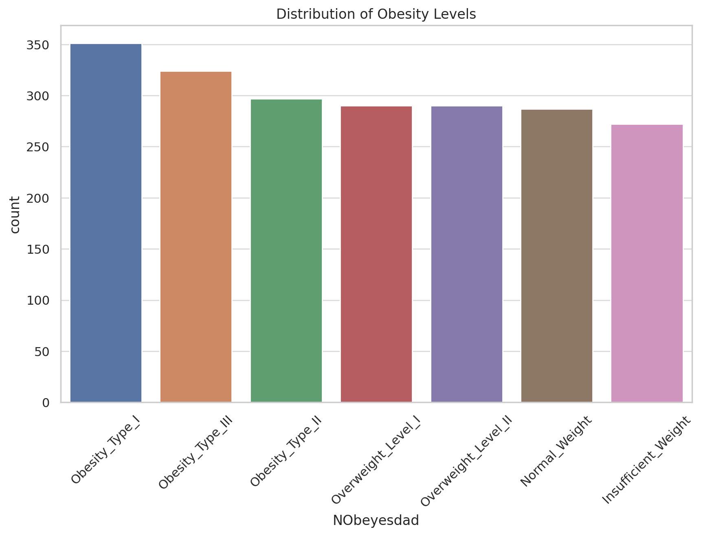
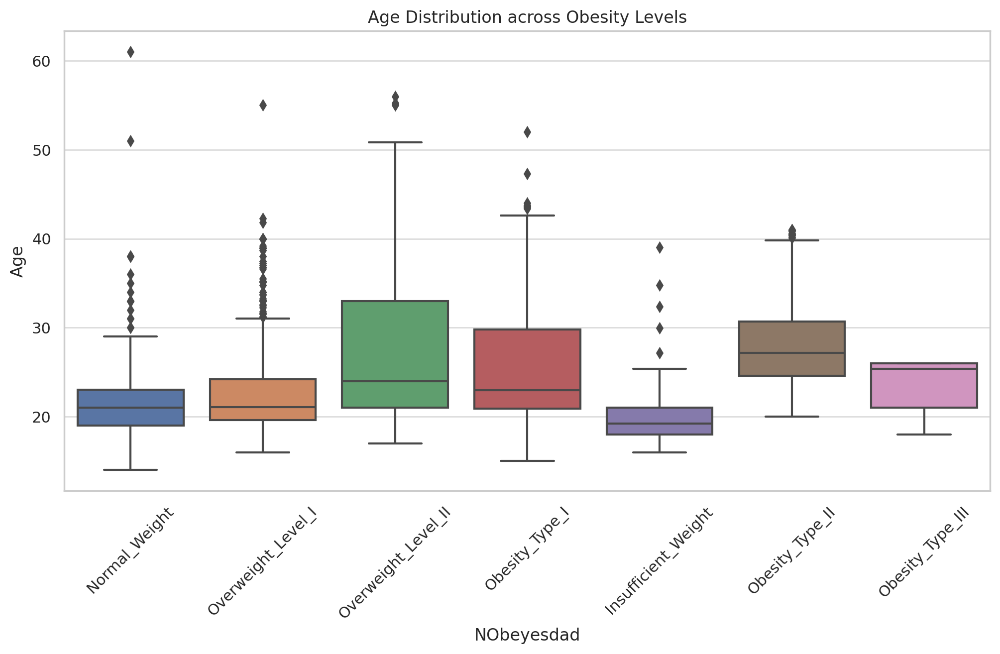
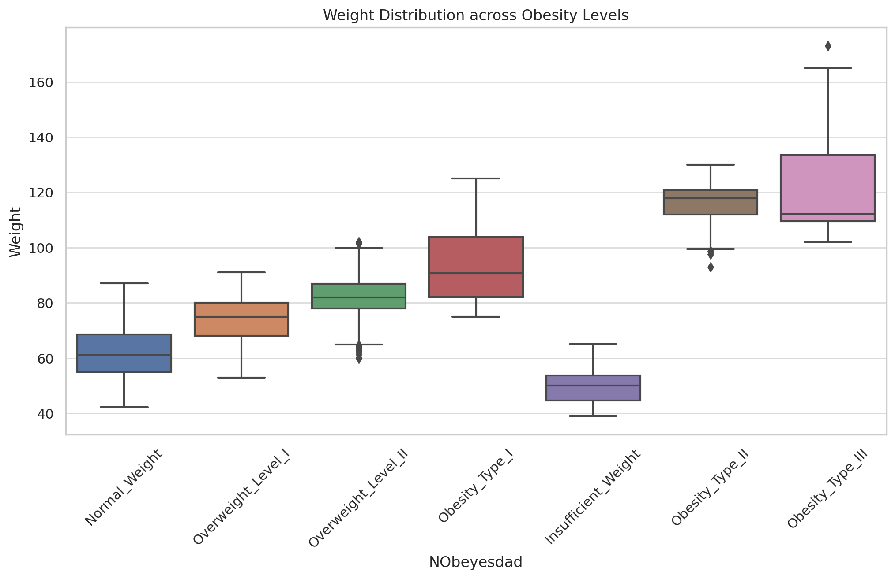
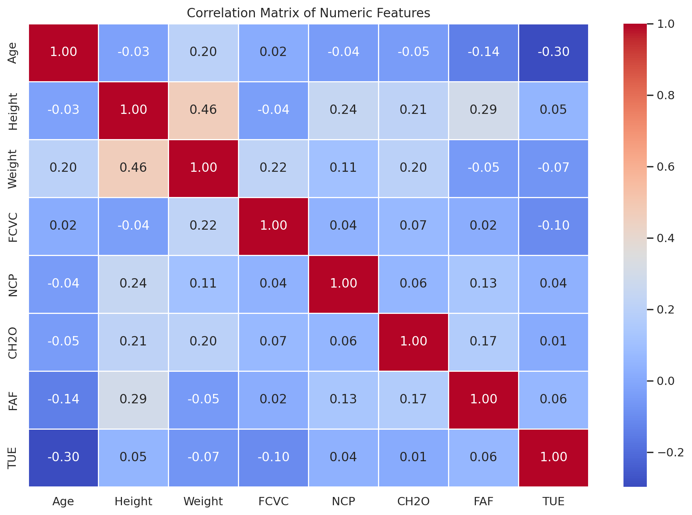
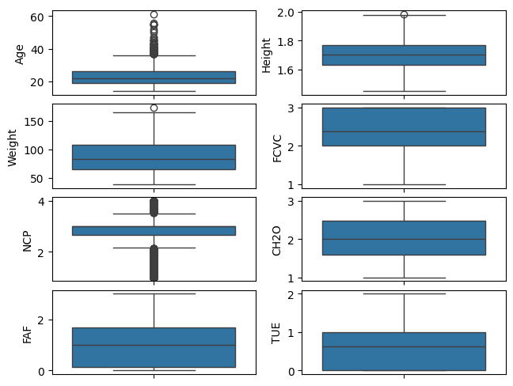

# Health Analytics using ML and Wearable Sensors

## 1.Directory Structure
```
├── data/                                           <- Contains data files.
│   ├── 1_ObesityDataSet_raw_and_data_synthetic.csv <- Raw and synthetic data for ObesityDataSet.
│   └── 2_Data_Clean.csv                            <- Cleaned data file.
├── notebooks/                                      <- Contains Jupyter notebooks.
│   ├── 1_Data_Cleaning_Part1.ipynb                 <- Notebook for Data Cleaning Part 1.
│   └── 2_Part1.ipynb                               <- Notebook for Part 1.
├── .gitignore                                      <- List of files and folders git should ignore
├── LICENSE                                         <- License file for the project.
├── README.md                                       <- Top-level README file providing an overview of the project.
└── requirements.txt                                <- File listing project dependencies.
```

## 2.Data Overview

The dataset consists of 2,111 records and includes the following columns:
- **Gender, Age, Height, Weight**: Demographic and physical data.
- **family_history_with_overweight, FAVC, FCVC, NCP, CAEC, SMOKE, CH2O, SCC, FAF, TUE**: Health and lifestyle-related features.
- **CALC, MTRANS**: Consumption habits and transportation methods.
- **NObeyesdad**: Target variable representing obesity levels.

## 3. Data Cleaning

The cleaning process in the notebook (`1_Data_Cleaning_Part1.ipynb`) involved several critical steps:

### 3.1 Handling Missing Values

No missing values were detected in the dataset. Therefore, no imputation was performed, as all values were intact after cleaning.

### 3.2 Scaling

Numeric columns such as `Age`, `Weight`, `FCVC`, `NCP`, `CH2O`, and `FAF` were **scaled** using **Min-Max scaling**. This transformation ensured that all features were within the same range (0 to 1), which is important for machine learning algorithms sensitive to the magnitude of the inputs.

### 3.3 One-Hot Encoding

Categorical columns like `CAEC`, `CALC`, `MTRANS`, and the target variable `NObeyesdad` were **one-hot encoded**. This process converted the categorical variables into multiple binary columns so that the machine learning models can interpret them correctly.

## 4. Exploratory Data Analysis (EDA)

### 4.1 Distribution of the Target Variable (`NObeyesdad`)

The target variable `NObeyesdad` represents 7 distinct obesity levels:
- **Normal_Weight**
- **Overweight_Level_I**
- **Overweight_Level_II**
- **Obesity_Type_I**
- **Obesity_Type_II**
- **Obesity_Type_III**
- **Insufficient_Weight**

The dataset is well-balanced with a wide variety of obesity levels, as shown in the distribution plot below. The target variable NObeyesdad shows a diverse distribution of obesity levels, with "Obesity_Type_I" being the most frequent class, followed by "Overweight_Level_I" and "Normal_Weight". This suggests the dataset captures a wide range of obesity levels.



Age and Weight Distributions Across Obesity Levels: As expected, individuals with higher obesity levels tend to have higher weights. There is some variation in age across obesity levels, but it's not as strong as the relationship with weight.






The following correlation matrix helps to identify relationships between numeric features:

- **Weight** shows a moderate positive correlation with both `Age` and `CH2O` (water intake).
- **FAF** (Physical activity frequency) is mostly uncorrelated with other variables, suggesting that it is an independent feature.

This correlation matrix helps highlight which features might be more important for predicting obesity levels. Since, Age and TUE features illustrate high correlation in the below heatmap, we can drop the TUE feature.



### Outliers Detection

As seen in the boxplots above, the age column has some outliers, however, age between 40-60 is not necessarily outliers. Therefore, outliers in age column does not need much treatment. Further, all other columns except for NCP do not have outliers. NCP column has outliers, however, it is not necessary to treat them as they are not extreme.




