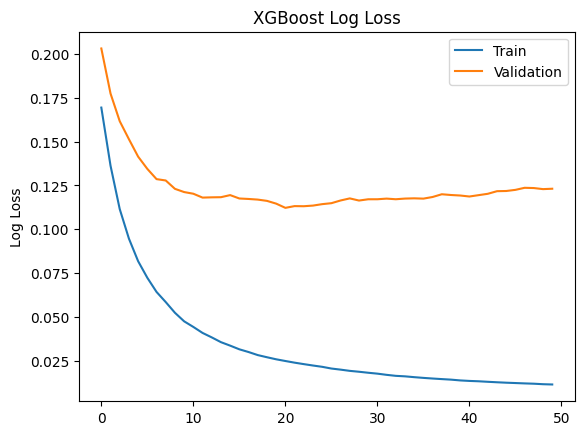
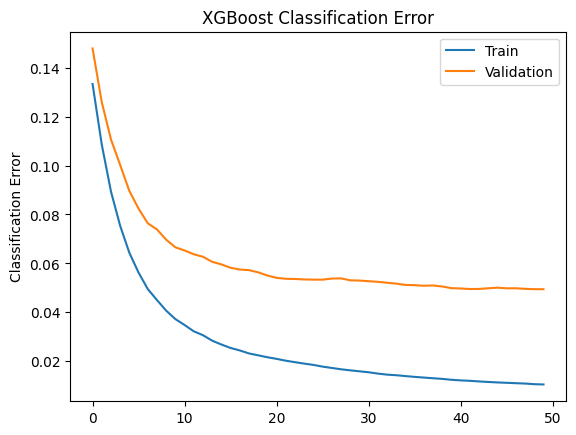

# Health Analytics using ML and Wearable Sensors

## 1. Directory Structure
```
├── data/                                           <- Contains data files.
│   ├── 1_ObesityDataSet_raw_and_data_synthetic.csv <- Raw and synthetic data for ObesityDataSet.
│   └── 3_data_clean.csv                            <- Cleaned data file.
├── notebooks/                                      <- Contains Jupyter notebooks.
│   ├── 2_data_cleaning.ipynb                       <- Notebook for data cleaning.
│   └── 4_ml_models.ipynb                           <- Notebook for ML Models.
├── ss/                                             <- Contains screenshots for README.
|   ├──age-distribution.png                         <- Age distribution across obesity levels.
|   ├──correlation-matrix.png                       <- Correlation matrix of numeric features.
|   ├──obesity-levels.png                           <- Distribution of the target variable.
|   ├──outliers.png                                 <- Boxplots showing outliers in the dataset.
|   └──weight-distribution.png                      <- Weight distribution across obesity levels.
├── .gitignore                                      <- List of files and folders git should ignore
├── LICENSE                                         <- License file for the project.
├── README.md                                       <- Top-level README file providing an overview of the project.
└── requirements.txt                                <- File listing project dependencies.
```

## 2. Data Overview

The dataset consists of 2,111 records and includes the following columns:
- **Gender, Age, Height, Weight**: Demographic and physical data.
- **family_history_with_overweight, FAVC, FCVC, NCP, CAEC, SMOKE, CH2O, SCC, FAF, TUE**: Health and lifestyle-related features.
- **CALC, MTRANS**: Consumption habits and transportation methods.
- **NObeyesdad**: Target variable representing obesity levels.

## 3. Data Cleaning

The cleaning process in the notebook (`2_data_cleaning.ipynb`) involved several critical steps:

### 3.1 Handling Missing Values

No missing values were detected in the dataset. Therefore, no imputation was performed, as all values were intact after cleaning.

### 3.2 Scaling

Numeric columns such as `Age`, `Weight`, `FCVC`, `NCP`, `CH2O`, and `FAF` were **scaled** using **Min-Max scaling**. This transformation ensured that all features were within the same range (0 to 1), which is important for machine learning algorithms sensitive to the magnitude of the inputs.

### 3.3 One-Hot Encoding

Categorical columns like `CAEC`, `CALC`, `MTRANS`, and the target variable `NObeyesdad` were **one-hot encoded**. This process converted the categorical variables into multiple binary columns so that the machine learning models can interpret them correctly.

## 4. Exploratory Data Analysis (EDA)

### 4.1 Distribution of the Target Variable (`NObeyesdad`)

The target variable `NObeyesdad` represents 7 distinct obesity levels:
- **Normal_Weight**
- **Overweight_Level_I**
- **Overweight_Level_II**
- **Obesity_Type_I**
- **Obesity_Type_II**
- **Obesity_Type_III**
- **Insufficient_Weight**

The dataset is well-balanced with a wide variety of obesity levels, as shown in the distribution plot below. The target variable NObeyesdad shows a diverse distribution of obesity levels, with "Obesity_Type_I" being the most frequent class, followed by "Overweight_Level_I" and "Normal_Weight". This suggests the dataset captures a wide range of obesity levels.


Age and Weight Distributions Across Obesity Levels: As expected, individuals with higher obesity levels tend to have higher weights. There is some variation in age across obesity levels, but it's not as strong as the relationship with weight.


The following correlation matrix helps to identify relationships between numeric features:

- **Weight** shows a moderate positive correlation with both `Age` and `CH2O` (water intake).
- **FAF** (Physical activity frequency) is mostly uncorrelated with other variables, suggesting that it is an independent feature.

This correlation matrix helps highlight which features might be more important for predicting obesity levels. Since, Age and TUE features illustrate high correlation in the below heatmap, we can drop the TUE feature.


### Outliers Detection

As seen in the boxplots below, the age column has some outliers, however, age between 40-60 is not necessarily outliers. Therefore, outliers in age column does not need much treatment. Further, all other columns except for NCP do not have outliers. NCP column has outliers, however, it is not necessary to treat them as they are not extreme.


## 5. Model Building

### 5.1 Classifying the people whether they monitor the calorie consumption or not (SCC)

- Using Sipport Vector Machine, I have achieved the following results:

| **C Value** | **Training Accuracy** | **Validation Accuracy**  |  **Test Accuracy**  |
|-------------|-----------------------|--------------------------|---------------------|
|    0.10     |     0.9597180293174   |     0.9431372549019608   |   0.9503641456582   |
|    0.25     |     0.9597180293174   |     0.9431372549019608   |   0.9503641456582   |
|    0.50     |     0.9597180293174   |     0.9431372549019608   |   0.9503641456582   |
|    1.00     |     0.9597180293174   |     0.9431372549019608   |   0.9456582633053   |
|    2.00     |     -                 |     0.9336694677871149   |   0.9432773109243   |


- Random Forest, we achieved the following results:
  | **Metric**              | **Random Forest Classifier** |
  |-------------------------|------------------------------|
  | Training Accuracy       | 1.0000000000000000           |
  | Validation Accuracy     | 0.9668246445497630           |
  | Test Accuracy           | 0.9598108747044918           |

- XGBoost, we achieved the following results:
  | **Metric**              | **XGBoost Classifier**       |
  |-------------------------|------------------------------|
  | Training Accuracy       | 1.0000000000000000           |
  | Validation Accuracy     | 0.9644549763033176           |
  | Test Accuracy           | 0.9598108747044918           |




### 5.2 Classification of the dataset into the 4 age groups as target variables
- Using Classifier Chains of Naive Bayes Algorithm

Naive Bayes has been chosen because of the following reasons:
- Simplicity: Naive Bayes is simpler and faster to train compared to Random Forest or XGBoost, which may require more time to tune hyperparameters like tree depth, number of estimators, learning rate, etc. In this case, simplicity is opted over complexity.
- Interpretability: Naive Bayes models are easy to interpret because they make predictions based on straightforward probability calculations.
- Data Size and Model Complexity: As the dataset is not too large and the relationships between features and target variables are relatively simple, Naive Bayes can perform well without the added complexity of models like Random Forest or XGBoost.

Why have Classifier Chains been used?
Although the age groups are independent in the data (as an individual can only belong to one age group), the model designer might have still opted for Classifier Chains for a few reasons:

- Capturing Relationships in a Sequential Manner: Even though the age groups are mutually exclusive, Classifier Chains could still help model more subtle relationships between features and age groups (e.g., patterns that might influence belonging to certain age groups). For instance, Classifier Chains could allow the model to learn that predicting Age_Group_14_19 makes predicting Age_Group_26.0_61.0 unlikely.

- Generalizing the Model: Classifier Chains are often used when there’s a possibility that labels may be related in other datasets or applications. It makes the model more flexible for potential future use, even if the age groups are independent in this dataset.

- No Harm in Using Classifier Chains: Since Classifier Chains allow for sequential predictions, they don't negatively affect the performance if labels are independent; they simply add the possibility to model relationships if they exist. In this case, they may still function similarly to normal Naive Bayes but with a different internal structure.


